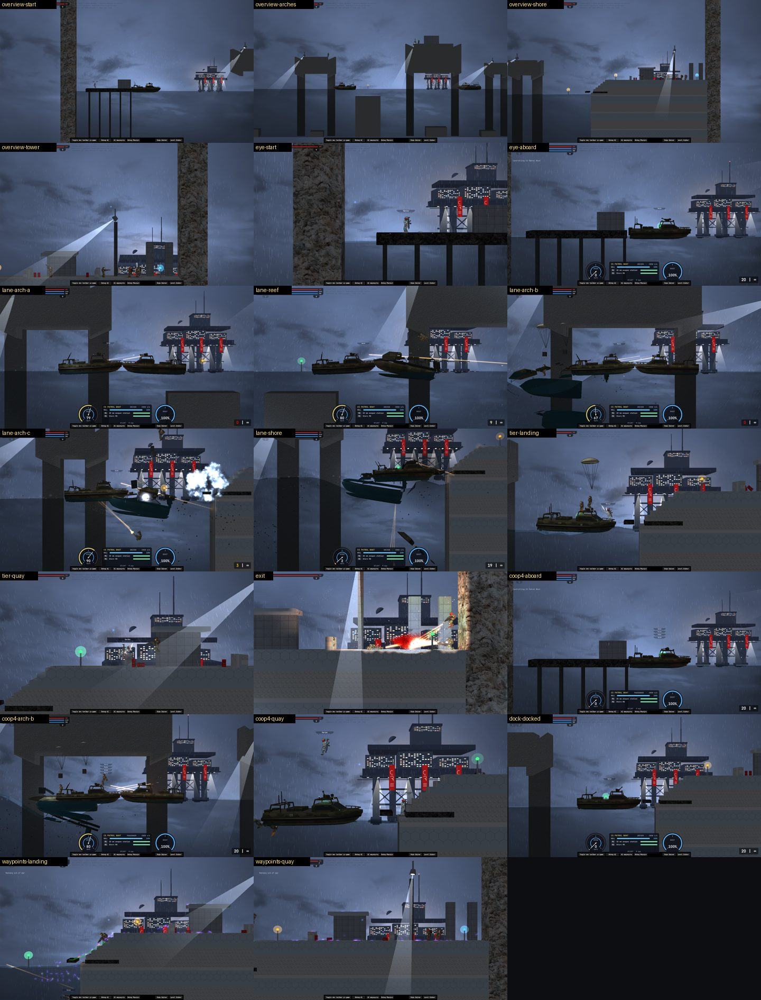

# 01 · Approach

Night, a storm coming in. The raiders take a CS patrol boat from a picket pontoon and run it east across open
water towards the Coastal Tower, which grows on the horizon. Three sea arches cross the boat lane. CS snipers, a
minigunner, rocket and grenade troops hold their tops, and searchlights sweep the water. CS patrol boats come out
to meet the raiders. The run ends at the shore checkpoint at the tower's foot: a jetty, steps up to the quay, the
guard post and the gate.

**Play it:** in PB3X → Mods, switch on **More vehicles** and **CS Coastal Tower**, then reload. Open the Level
Editor → **CS Tower** → **Load 01 · Approach** → *Play as tester*. It's an ordinary editor map from then on: every
object can be moved, changed and saved as your own map.

## Layout (game px: x to the right, y down, the waterline at 0)

| Stretch | x | What's there |
|---|---|---|
| Picket pontoon | 380–1,080 | The start: deck 40 px up, a CS hut and lamps, a rifle and pistol at your feet. The raiders' boat is moored off its end (1,320), with a berth checkpoint there. |
| Arch A | 2,600–3,400 | Top at −640, the lane under it clear to −300 (300 px). A Marksman and a Trooper on top, and a searchlight. |
| Reef | 3,800–4,300 | A rock 150 px under the surface, with a buoy light and a berth checkpoint over it. |
| Arch B | 4,800–5,900 | The big one: top −900, clear to −320. A Heavy (minigun), a Rocketeer, a ruined watch post, and a second Marksman [2+]. |
| Arch C | 6,400–6,900 | Top −520, clear to −290. A Grenadier and a searchlight. |
| Landing | 7,560–7,900 | A jetty level with the boat's deck (48 px up), then six 29 px steps up to the quay. Its front is a slab over a water bay, then a hatch open to the sky with a step up out of the water; the rest is solid to the seabed. The berth checkpoint is at 7,300. |
| Quay | 7,900–9,400 | Top at −220. An on-foot checkpoint at 8,020, cover walls (60 px), fuel barrels, the booth, a searchlight tower, the gate and the exit (9,255). |
| Backdrop | 12,000 | The Coastal Tower, 20,000 px behind the level, drawn in 3D by the mod. |

Clearances come from `metrics.md`. The Patrol Boat is 136 px tall, so every arch leaves at least 290 px. The
steps are within the 32 px automatic step-up. The start pontoon is 40 px above the water and the jetty 48 px, so a
swimmer climbs out of either: the limit is 100 px.

The jetty took three tries, all found by the passes:
- **A deck 40 px up, on piles.** The boat's raked bow stopped short of it, and players stepping off fell into the
  gap. Under the deck, with the quay wall behind, a swimmer could be pinned without air.
- **15 px up, solid.** The bow rode up onto the edge. The boat beached, and at full astern it couldn't back off.
- **Level with the boat's deck (48 px), sheer.** The boat noses up to it by its bow's tip, you walk straight off,
  and it backs away freely (1,300 px in 5 s). Its bow then covers the water in front of the jetty: a swimmer can't
  climb onto a boat, and there was no way out. So the jetty's front is a slab over a water bay (30 px of air), then a
  hatch open to the sky with a step up (24 px). A swimmer under the bow, or one who dives under the boat, comes up in
  the hatch and climbs out. Walkers cross the 30 px hatch in their stride.

`levels/dock-01.js` checks all of it: the boat docks and backs off, you land dry, and both swimmers get out.

## Enemies (Civil Security) and co-op

| Where | 1 player | + with 2 players | + with 3–4 players |
|---|---|---|---|
| Arches (posts) | Marksman, Trooper, Heavy, Rocketeer, Grenadier | Marksman [2+] | — |
| Patrol boats (helm + gunner) | Patrol 1 (3,620), Patrol 2 (6,100) | Patrol 3 (7,000) | Patrol 4 (5,300) |
| Quay | Trooper with shotgun (hunts: comes down to the landing), Trooper (post, at the booth), Heavy with flamethrower (post), Sergeant with OICW (holds the gate) | Trooper (hunts) | Trooper (hunts) |

- **Patrol boats** drive themselves (the mod's autopilot). Each wakes within 1,900 px of a player. It closes to
  650 px and holds there while its gunner works the boat's gun. It never passes the raiders' boat, and it keeps to
  its own stretch of water. Kill the crew and the boat is scuttled. When a boat is destroyed, its riders eject by
  parachute.
- **Co-op:** the host counts the players 4 s into the level and removes the enemies marked for more players than
  that. Anyone who joins or dies gets a new character after 5 s. While the fight is on the water, it is seated
  aboard the raiders' boat. Once a player has reached the quay's on-foot checkpoint, it appears there instead. A
  player who joins before the host boards takes the helm, and the host takes the next free seat. If the boat is
  lost, a new one appears at the last berth checkpoint 8 s later.
- **Checkpoints** light when any player passes them. The **exit** counts when any living player reaches it, and
  shows "01 · Approach — cleared".

## Verification

The plan's checklist, run in the live game with PB3X loaded, from `tools/harness/levels/` (the Level Editor → the
mod's objects → *Play as tester*). The build container's GPU is SwiftShader, a software renderer, so frame times
are only comparable within this table, not what a real GPU gives.

| Check | How | Result |
|---|---|---|
| No stuck spots | `play-01.js` (the route with damage switched off), `dock-01.js`, `coop-01.js` | The route runs end to end: along the pontoon, aboard, under the three arches, the landing, the steps, the quay, the exit. At the landing, stepping ashore is dry, and a swimmer under the bow or behind the boat gets out through the hatch. The first two landings failed these checks (see above). |
| Every jump makeable | the measured numbers (`metrics.md`) | The route needs no jump. Steps are 28–30 px (the automatic step-up is 32), the hatch's step is 24 px, and edges to climb out onto are 24–48 px (the rule is ≤ 80). The quay's cover walls (60 px) are hopped: a rifleman's jump is 73 px. |
| Vehicles fit and can leave | the route, `dock-01.js` | The boat (136 px tall) clears every arch by 150 px or more. It docks level at the jetty, backs off 1,300 px in 5 s, and docks again. The patrols keep to their beats and hold 650 px off. |
| Enemies path | `waypoints.js 01` | With a player on the jetty, the quay's hunters walk down the steps (600–1,100 px in 20 s), and Patrol 2 closes to its standoff. The posts hold, and Patrol 1 (over 1,900 px away) stays asleep. The waypoint shots show the engine's own path lines. |
| Frame rate | `perf.js 01` | 1.2–1.35× the frame time of the editor's own starting map (table below). The extra draw calls are mostly characters and boats, the game's usual load. The tower backdrop is merged into 18 draw calls (from 82). |
| Screenshots from 4+ angles | `publish-shots.py` | The overview (4), the eye line (2), the boat lane (5), each tier (landing, quay), the exit, co-op, the docking and the AI's paths: `shots/01/`. |
| Co-op, 2+ players | `coop-01.js --players 2` and `--players 4` | 2 players: the `[3+]` enemies and Patrol 4 are removed. The guest spawns at the helm and drives. Both land. A guest killed on the quay is back on the quay 7 s later, and the exit counts. 4 players: nothing is removed, all four ride (seats 0–3), and all four land. A guest killed is back, the exit counts, and the page has no errors. |
| (extra) With real damage | `play-01.js --mortal` | The scripted player only walks forward and shoots the nearest enemy, yet clears the level. It died 4–6 times at the landing and on the quay, coming back each time: aboard, then on the quay once that checkpoint was lit. The boat reaches the landing with 1,600–1,700 of its 2,400 hp. When real fire sank it before the landing, a new one was waiting at the last berth. |

| Frame cost at 1600 × 900 (SwiftShader) | Mean frame | 95th percentile | Draw calls | Triangles |
|---|---|---|---|---|
| The Level Editor's starting map (terrain, grass, 2 characters) | 139 ms | 233 ms | 98 | 3,900 |
| 01 · Approach, the start | 167 ms | 250 ms | 454 | 61,000 |
| 01 · Approach, Arch B | 178 ms | 300 ms | 363 | 60,000 |
| 01 · Approach, the shore | 185 ms | 217 ms | 452 | 60,000 |

**Fixed along the way (found by these passes):**
- The tower backdrop didn't render. The game's three.js never uploads `viewMatrix` or `normalMatrix`.
- The tower was drawn in front of the walls, because its shader wrote log depth; the game's shaders don't.
- The tower was too big and floated at eye height. It is now pinned to the waterline from a render hook.
- Respawns followed the dead player's controller, which goes with the character, so nobody came back. They now
  follow the player's connection.
- A joining player's seat was never filled: the mod's free-seat test was wrong.
- A runner at a low frame rate could skip past the exit. A crossing now counts.
- The landing: three versions (see above).
- The replacement boats' berth points were moved clear of the pontoons.
- The quay's defenders now hold the quay, with one hunter per player coming down. Before, every one of them came
  down to the boat.
- After reaching the quay, players now come back on the quay instead of in the boat behind.
- The harness holds back the game's automatic error reports, so our test crashes don't reach the site.

## Not in this level yet

- **Trees and grass on the arch tops, and an idle swell.** They come with `cs-weather-terrain`: the engine's own
  foliage needs terrain-generating surfaces, which stop this map's wall mesh being built, and the engine has no
  idle waves.
- **The HD sky.** It comes with `cs-skies`; the level uses the game's own night sky for now.
- **A networked co-op run.** The co-op pass (`levels/coop-01.js`) runs the other players as stand-in connections in
  the host's game. The engine's own player assignment and the mod treat them as joined players, but no network is
  under them. A run across two machines needs a second Plazma Burst 3 account.
