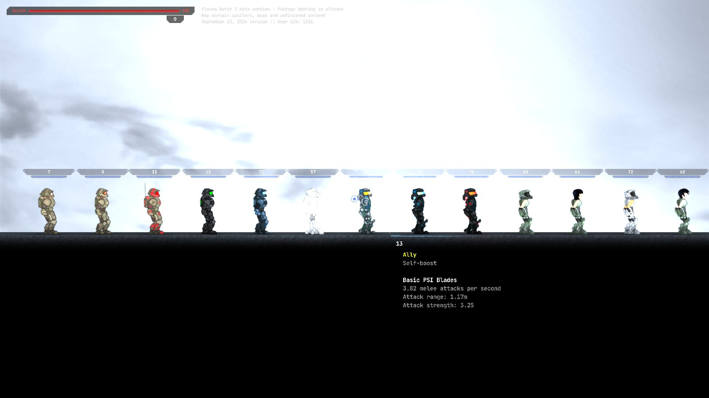
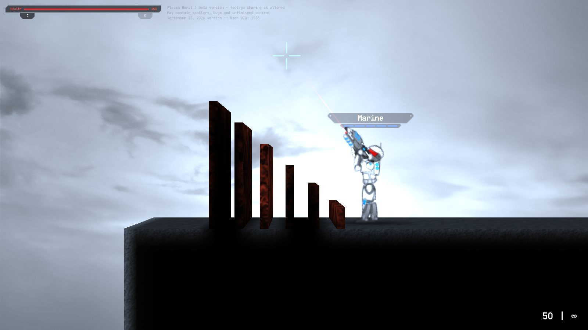

# Phase 0 — measurements

What the CS Coastal Tower levels are built from: the character, the vehicles and the skins, **measured by playing the
live game** (plazmaburst.net, the "September 23, 2026" build, with PB3X 0.0.26 loaded). The engine rules below come
from reading the engine's own scripts. Every level dimension in `PLAN.md` is re-derived from these numbers
(§ 2).

Units: game px, with y pointing down (the engine's own units); game seconds (30 ticks a second). Code-read values say
so; everything else was measured. The harness that measured it is `tools/harness/` (§ 7). Its raw samples are in
`metrics-data/`, and the pictures are in `shots/phase0/`.

---

## 1. The player character

The runs used the default Marine, a flat floor, and a fixed 60 fps physics step. There are two loadouts. **Rifle**
means a gun in hand (slot 2); that is how the campaign is played, so the levels are designed for it. **Bare** means
slot 0, the sword every character carries. The engine gives slot 0 a ×1.25 run force and an extra 60 px/s of jump
(code-read), so a player with the sword out can do more than the levels ask for.

| | Rifle in hand | Bare / sword | Notes |
|---|---|---|---|
| Height, standing | 79 px to the head's top (physics box 70) | same | box 20 wide; the ragdoll's atoms span 22 px |
| Height, crouched (S or left Ctrl) | 61 px (box 56) | same | |
| Run | **312 px/s**, 95 % after 0.8 s | 418 px/s | engine formula 312 / 420 |
| Sprint (left Shift, once moving) | **565 px/s**, reached after about 2 s | 673 px/s | formula 564 / 672; sticks until you stop |
| Crouch-walk | 182 px/s | 257 px/s | formula 182 / 258 |
| Jump: feet rise | **73 px** | 109 px | holding W re-jumps on landing; how long W is held doesn't change the height |
| Jump: head at the apex | 147 px above the floor | 183 px | |
| Jump: time to apex / in the air | 0.5 s / 1.0 s | 0.7 s / 1.3 s | gravity 450 px/s² |
| Air control from a standing jump | 92 px sideways | 115 px | |
| Running jump (takeoff → landing, level) | **326 px** at 304 px/s | 568 px at 410 px/s | |
| Sprint jump | **591 px** at 564 px/s | 887 px at 664 px/s | |
| Highest ledge climbed (run-up, jump, grab, climb) | **160 px** (180 fails) | 200 px (220 fails) | ledge grab: a box corner within 40 px of the chest (code) |
| Widest gap crossed (level platforms, edge to edge) | **360 px** (420 fails) | ≥ 600 px (all tested widths made it) | beyond the 326 px running jump: the hands catch the far edge |
| Drop with no damage | **400 px** | 400 px | rifle: 450 → −74 hp, 550 → −70, 650 → −80, **750 kills**; bare: 450 → −43, 550 → −50, 650 → −69, 750 → −81, **900 kills** (of 150). Above 400 it depends on how the ragdoll lands |
| Step up without jumping | ≤ 32 px (≤ 16 crouched) | same | code-read |
| Swimming | 216 px/s along, 202 px/s down, 211 px/s up (from 600 px down) | same (the gun doesn't matter in water) | limp ragdoll; floats at the surface when idle |
| Climbing out of water | onto an edge ≤ **100 px** above the surface (120 traps you) | — | hold W and toward the edge |
| Air under water | **16.7 s**, then about 3.7 s to drown | same | code-read; the game's HUD says "Oxygen depletion in 16.7 seconds" |

Other movement (code-read, not needed by any level):
- **Wall jump:** hold jump as you meet a wall without pushing into it. It throws you 210 px/s off the wall and
  210 px/s up.
- **Self-boost:** fire with the sword out while rising. It adds about 147 px/s.
- There are no ladders and no one-way platforms. Slopes steeper than 37° are slides.

## 2. Design rules (what every level uses)

The levels are designed for the **rifle** numbers, with a margin. The bare-hands numbers are a bonus for skilled
players, never a requirement.

| Rule | Value | From |
|---|---|---|
| Ceiling over any walkway | ≥ 100 px | 79 px standing + 20 |
| Ceiling where people jump or fight | ≥ 170 px | head at the apex 147 + 20 |
| Crawlspace (crouch only) | 70–80 px | 61 px crouched |
| Stairs | risers ≤ 30 px, treads ≥ 30 px | step-up 32 |
| Block you hop onto without grabbing | ≤ 60 px | feet rise 73 |
| Ledge you climb (jump + grab) | ≤ 140 px | 160 climbed with a rifle, less 20 |
| Gap for an everyday jump (a short run-up) | ≤ 240 px | 74 % of the rifle's running jump (326) |
| Gap at a run (a "real" jump) | ≤ 300 px | 92 % of the running jump (326); 360 is the limit with a grab |
| Sprint-only gap (optional route) | ≤ 540 px | 91 % of the sprint jump (591) |
| Drop you may be asked to take | ≤ 400 px | no damage up to 400 |
| Drops of 450–900 px | avoid | 40–80 hp and sometimes death (750 killed a rifleman) |
| Drop that is a deliberate hazard | ≥ 1,000 px | 750–900 already kills |
| Longest dive between air | ≤ 12 s of swimming: ≤ 2,400 px of route | 16.7 s of air, less a margin, at ~200 px/s |
| Edge a swimmer climbs out onto | ≤ 80 px above the water | 100 measured, less 20 |
| Screen | 1208 × 680 px of the world | the game camera: fov 45°, 821 px back; the window is letterboxed to 16:9 |

**Where enemies walk** (code-read from the engine's path-finding; it has no hand-made nav mesh):
- Enemies can only jump gaps of about 165 px, and rises of about 120 px.
- Their walk links join floors less than 56 px apart in height.
- A floor needs a free 20 × 56 px to be walkable.
- Enemy routes use gaps ≤ 150 px, rises ≤ 110 px, or stairs. Anything bigger is a player-only route, and good
  cover from pursuit.

## 3. Vehicles (placed in the game, the More vehicles mod on)

Each vehicle's **collision outline once it has settled**: every fixture that collides, of every body it has. The
other numbers are the mod's own specs (`__moreVehicles._specs`), which its boarding and driving code uses directly.

| Vehicle | Outline (w × h) | Rests | Seats · boarding reach | Other |
|---|---|---|---|---|
| CS Patrol Boat (Boat, style 1) | **429 × 134 px** | 117 px above the water, draft 17 px | 6 · 220 px | 540 px/s; 1200 hp |
| CS-S1 Wraith (Submarine, style 1), surfaced | **2269 × 488 px** | sail 38 px above the water (its masts are drawn higher), keel 450 px down | 1 (captain) · 48 px at the port | port 278 px aft of centre, trunk 60 px; decks: upper 110 px headroom, lower 100 px, doorways 76 px; 290 px/s |
| CS-7 Viper (Helicopter, style 2) | **535 × 122 px** | on its gear | 2 · 250 px | rotor ⌀ 497 px (model), mast 79 px above the hull's origin; 1200 hp |
| CS-4 Ranger (Tank, style 4) | **240 × 103 px** | 113 px tall on its wheels | 2 · 170 px | 520 px/s top; 350 hp |
| CS-2 Bastion (Tank, style 3) | **307 × 126 px** | 136 px tall on its wheels | 8 · 190 px | 330 px/s top; 350 hp |

The plan's working numbers were close: Wraith ≈ 2,280 × 285 hull (+ sail), boat ≈ 430 × 136, Viper ≈ 535 × 125. What
changes:

- **Boat berths:** ≥ 600 px (429 + 2 × 85 to come alongside). The water must be ≥ 60 px deep (draft 17).
- **Wraith, surfaced:** water ≥ 560 px deep (488 + 70).
  - **Dry dock:** ≥ 2,700 × 560 px. The plan had 2,700 × 450; 450 is too shallow.
  - **Diving:** ≥ 700 px of water to dive clear of both the surface and the floor (hull 488 + 100 + 100).
  - **Overheads:** keep them ≥ 250 px above the surface where it passes surfaced, to clear its drawn masts. The masts
    were checked by eye in the shot, not measured.
- **Viper pad:** ≥ 620 px long. Keep 260 px either side of the mast clear up to 140 px above the pad, for the rotor
  disc.
- **Ranger / Bastion:** doorways ≥ 160 px tall (136 + margin) and gates ≥ 340 px wide. How steep a ramp each can
  climb is measured in the first level that has one (03).
- **AI:** bots never board vehicles on their own. `driver_of` puts a bot in the seat, and a seated bot aims and fires
  the vehicle's gun. Their driving is crude, so enemy boats, Vipers and CS tanks still need the planned autopilot.

## 4. Skins (drawn in the game)

These `SpawnDefaultSkin( frame )` ids draw their own art. The frame is the name over each head in the shot.

| Who | Frames |
|---|---|
| **Civil Security** | **7 CS Heavy**, **8 CS Lite** (rank and file), **11 CS Boss** (red), **12 CS Ghost** (black, green visor), **77 CS Blue**, 17 Digits (a CS Ghost robot) |
| **Noir Lime** | **13**, 73 (blue), 74 (red) |
| **Proxy** (the game's name for Proxy Girl) | **60** (3 is the same), 61 B, 72 C, 62 D, 63 E, 75 blue, 76 red (61–63 have no helmet) |

Frames the engine only has a *name* for draw as the plain Marine, identical to frame 1. The shot checks: 78 CS Lite
red, 137 CS Riot, 23–26 Guard, 32 / 89 Civil Protector, 19 Raven, 133 Federation Soldier, 149 / 150 S.W.A.T. The
Bosses arena's ally "Hawk" (frame 25) is therefore a Marine.

There is no CS sniper or elite art. Those roles use 12 (Ghost), and 11 (Boss) for officers. A team's
`recolor_skins` can tint a squad.



## 5. AI, weapons, entities, map objects (read from the engine)

**AI presets** (`pb2AIModule`):
- `BEHAVIOR_MPBOT` (3) hunts, follows, heals and surfaces for air. `BEHAVIOR_IDLE` (0) is a stationary guard that
  still shoots.
- Fields: `skill` (reaction lag 400 → 125 ms), `hunt_attacker`, `hunt_seen_threats`, `hunt_random_known_threats_range`
  (1000 in the editor), `heal_teammates`, `hear_range` (600), and the trick-shot switches.
- Sight with `VISION_SCREEN_BOX` is about ±1203 × ±677 px.
- Scripts reach a bot through `character.controller.ai` (`GoTo( x, y, mode )`).
- Hand-made links: `pb2AIPathFindingHint.Create`. Only its switch action does anything.

**Weapons** (ids for `pb2Gun.CreateGun`; the Civil Security ones in bold):

| Role | Guns |
|---|---|
| Pistols | **gun_pistol2** CS-Pistol, gun_pistol |
| Rifles | **gun_real_rifle** CS-RC, **gun_oicw** CS-OICW, gun_rifle C-01r |
| Shotguns | **gun_real_shotgun** CS-DAZ |
| Snipers | **gun_sniper** CS-YippeeKiYay, **gun_railgun** CS-HShot |
| Explosives | **gun_rl** CS-LitBro, **gun_gl** CS-SpamThemBaby |
| Heavy | gun_minigun, **gun_flame** CS-Lighter, **gun_plasmagun** CS-Bloom, **gun_shaft** |
| Support | **gun_defibrillator** CS-Sting, gun_repairgun |
| Vehicles | **gun_cs_vehgun** Heavy Minigun CS-MountyPython, gun_vehminigun, gun_vehcannon2 |

Grenades are given with `AddGrenades( type, n )`: 1 HE, 3 CS-Quarium shield, 5 smoke, 6 flash, 7 CS-Napkin gas,
8 mine, 17 CS-Denier turret.

**Entities:**
- Barrels (8 kinds), crates.
- Turrets: Facet, CS-Denier, and two drones. They need a team and a gun.
- The Hound Walker-CS (600 hp, 1 seat), TGS Mobiles (styles 2 and 3), the Corvette, floating ice or rock.

**Map objects:**
- Walls, backgrounds, movables (doors and lifts: `StartMove`, `SetSpeed`; with `hea` they break), water, regions
  (`onEnter`, forces, damage), timers, switches, lights, decorations.
- On-screen text and dialogue: `pb2WindowHint`, subtitles, reply choices; `ragdoll.Speak` for voice.
- There are no respawn, checkpoint or win-condition objects. The level set scripts them from `onDeath`, regions and
  timers (`RestartMap` / `ChangeMap` to move on; `pb2Storage` for progress).

## 6. Engine internals for the new mods (read from the engine)

- **Sky** (for `cs-skies`):
  - The sky is a full-screen shader pass, `pb2_mp.vI`. It runs first after the light map in the composer `pb2_mp.XM`
    (passes: light map, sky, world, overlay, final, HUD).
  - It uses its texture only as brightness × `sky_color`, fixed to the screen.
  - A panorama fits as our own pass in that slot, looked up from the camera. The original object stays alive: fog
    and the water mirrors read its uniforms.
  - Explosions insert passes at index 2, so we find our anchor by object, not index.
  - Water mirrors redraw the scene, not the sky pass. For them, a camera-locked sky mesh behind the background
    terrain (renderOrder below −1000).
- **Light is baked at load:** the GI light points (sky colour), the static light map (sky + sun), the terrain's
  vertex light. The sky's colour must reach `sky_color` / `sky_intensity` / `sun_*` before `FinalizeWorld` bakes
  them. The `_amb.webp` average is made for that. Later changes only partly apply; fog can be re-tinted live.
- **Weather** (for `cs-weather-terrain`):
  - Rain and snow are one fixed pool of 1564 CPU particles, spawned at map build. They ignore wind.
  - There is no lightning, so flashes are ours: dynamic `pb2Light` plus the final pass's grade.
  - Wind drives foliage (through a worker; it can be changed at runtime) and cloth only.
  - Foliage has one template (EARTH: grass strips and 9 bush kinds, one atlas).
  - Breakable rocks = movables with `hea`, then `FinalizeNewMovables()`.
- **Water** (`pb2WaterClass`):
  - Settings: kind (water, toxic, corrosive, lava, freezing, zero-g), colour, opacity, viscosity, density,
    reflection (a planar mirror).
  - Waves only come from things entering the water and from explosions. There is no idle swell.
  - There is **no current setting**. The buoyancy controller has an unused velocity (`shape.Zw.velocity`), which is
    the likely hook for the channels' currents (host-side).
- **Post effects** (for `cs-postfx`):
  - Insert after the world pass (`XM.insertPass`).
  - Work in half intensity: the final pass doubles.
  - There is no tone mapping and no depth texture. Light shafts need their own depth pass.
- **Textures** (for `cs-assets`):
  - A map can only name built-in textures or site Creations.
  - A mod can register one: a `lib[ name ]` symbol with `nominalBounds` and `draw( ctx )`, then
    `pb2Texture.dV( name, { ru: true, BM: true } )`, marked `internal` so it survives map resets.
  - Materials have no normal maps, so the `_normal.webp` files are for our own 3D sets.

## 7. How it was measured

`tools/harness/` drives the real game in Chromium with `pb3x-extension` loaded (Playwright, under `xvfb-run`):
- It logs in with a Plazma Burst 3 authentication file (`login.js`; the file is never stored in the repo).
- It starts offline maps written by `mapjs.js` / `rigs.js`.
- It presses the game's own keys: left Shift and left Ctrl need `location: 1`.
- It runs the physics at a fixed step (`pb2_mp.DEBUG_FORCE_GSPEED`).

```sh
cd tools/harness
node login.js /path/to/Plazma_Burst_3.auth                  # once per profile
node phase0/run.js [bare|rifle] [only:size,run,sprint,crouchWalk,jump,runJump,ledges,gaps,falls,swim]
node phase0/vehicles.js && node phase0/skins.js && node phase0/labshots.js
node phase0/analyze.js bare rifle                            # the numbers in § 1
```

(each under `NODE_PATH=/opt/node22/lib/node_modules xvfb-run -a -s "-screen 0 1600x900x24"`)

The lab: a 6,000 px lane with a ruler (posts 20–120 px); ledges 40–320 px, each with a 780 px run-up; gaps 120–600
px over a pit; a 2,400 × 1,100 px pool.


